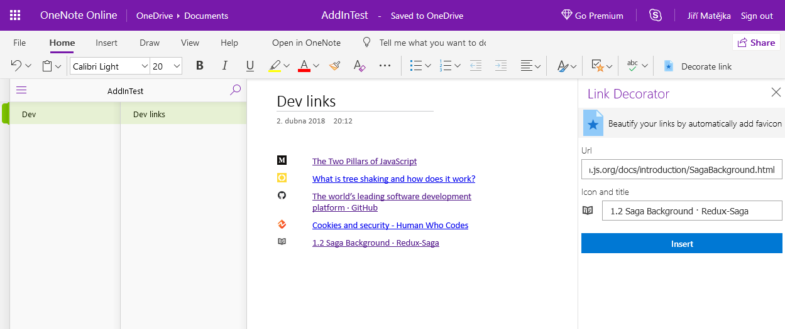

## OneNote Link Decorator Addin
#### Addin intended for simplifying bookmarking in OneNote

It's purpose is to automatically insert favicon and title from the link being pasted to OneNote page.
Created as exploration of OneNote JS Api proof-of-concept, currently in alpha status, there are some serious limitations.

